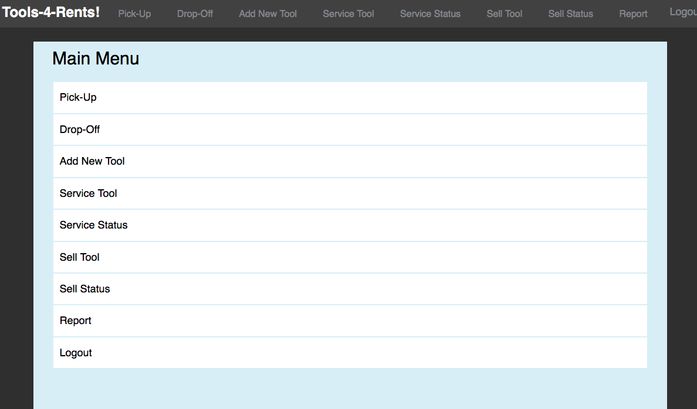

# PHP_MySQL_demo
This is a course project for building a website incorperate both frontend UI design (html,css,javascript) and backend relationship database design (php and mysql).

This website is a demo for a renting tools websites mainly for the interaction between clerk and customer. Customer make research for some tools at any day, and clerk is resposible for picking up and dropping up the tools, and also some other responsibilities like adding tools and generate reports.

The webiste for the customer main manu is the following

The login is the following: reading the correct username and checking the related MySQL database

Register is the following: read the form from html and did the input validation and add to the Customer relation in the database

After login, the customer is responsible for making reservertion and check tool availbilities. Noted any tool cannot be rented twice at the same time.

I implemented several functions for finding tools including check the starting date, ending date and check the tool type, check the keywords etc. This parts are all done by javascript for dynamically adjusting the dropdown lists.

On the other hand, the clerk is responsible for dropping off or picking up any revervations. The clerk's main manu is the following

The following is the clerk pickup page

Also, the clerk need to perform add tools functions. This part is also javascript entensive, need to perform a lot of checking based on the previous dropdown manu to display the current dropdown manu and the page content.

One last thing, the clerk may also want to generate report as the following

Overall, although this is just a demo website, it includes many aspects from relational database design, front end UI implementation and backend implementations
